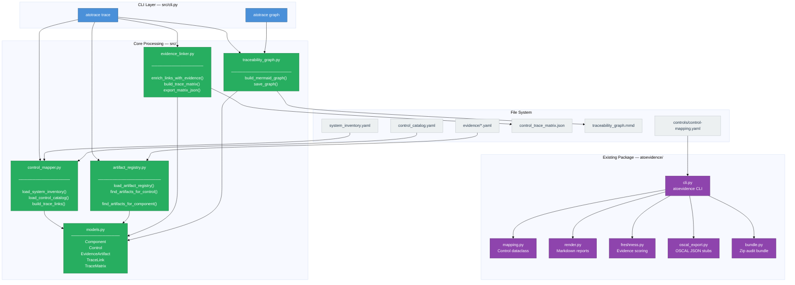

# Component Architecture

<!-- SPDX-License-Identifier: Apache-2.0 -->

This diagram shows the internal Python module structure of the engine and
the data types that flow between them.

---

## Module Summary

| Module | Package | Responsibility |
|---|---|---|
| `cli.py` | `src` | Click-based CLI; orchestrates pipeline |
| `control_mapper.py` | `src` | Loads inventory + catalog; builds trace links |
| `artifact_registry.py` | `src` | Scans evidence dir; builds artifact registry |
| `evidence_linker.py` | `src` | Enriches links; assembles + exports matrix |
| `traceability_graph.py` | `src` | Generates Mermaid graph from matrix |
| `models.py` | `src` | Pure dataclass definitions (no I/O) |
| `cli.py` | `atoevidence` | Legacy CLI: freshness, OSCAL, bundle |
| `mapping.py` | `atoevidence` | Legacy control dataclass + YAML loader |
| `freshness.py` | `atoevidence` | Evidence freshness scoring |
| `oscal_export.py` | `atoevidence` | OSCAL JSON stub export |
| `bundle.py` | `atoevidence` | Audit bundle ZIP creation |
