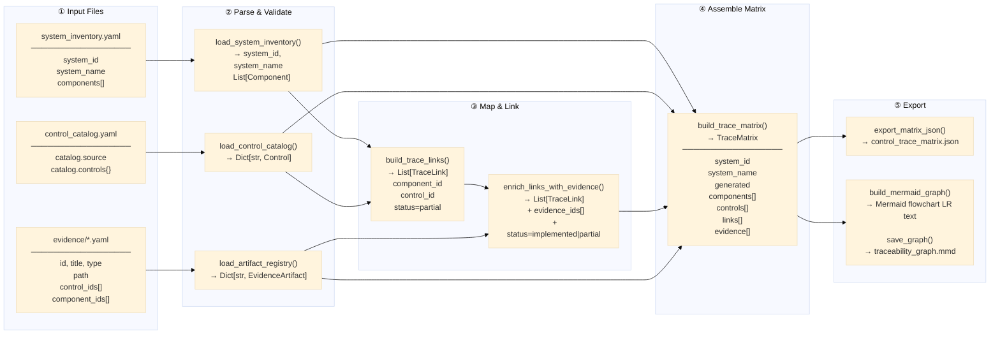

# Data Flow Diagram

<!-- SPDX-License-Identifier: Apache-2.0 -->

This diagram traces the data transformations from raw input files through to
the final compliance matrix and traceability graph.



---

## Data Type Reference

### `Component`
```
id:          str   — unique identifier (matches component_mapping in catalog)
name:        str   — human-readable display name
type:        str   — web_application | microservice | database | ...
owner:       str   — team or individual responsible
description: str
tags:        List[str]
```

### `Control`
```
id:               str        — NIST 800-53 control ID (e.g. "AC-2")
title:            str
family:           str        — e.g. "Access Control"
description:      str
baseline:         List[str]  — ["low", "moderate", "high"]
component_mapping: List[str] — component IDs that implement this control
```

### `EvidenceArtifact`
```
id:             str        — unique artifact identifier
title:          str
type:           str        — test_result | policy | log_sample | configuration | procedure
path:           str        — relative path or URL to the artifact
description:    str
control_ids:    List[str]  — controls this evidence satisfies
component_ids:  List[str]  — components this evidence covers (empty = all)
date_collected: str|None   — ISO-8601 date
```

### `TraceLink`
```
component_id: str       — FK → Component.id
control_id:   str       — FK → Control.id
evidence_ids: List[str] — FK → EvidenceArtifact.id[]
status:       str       — implemented | partial | not_implemented | not_applicable
```

### `TraceMatrix` (JSON output shape)
```json
{
  "system_id": "ato-demo-system",
  "system_name": "...",
  "generated": "2025-03-15T10:00:00Z",
  "summary": {
    "total_components": 8,
    "total_controls": 17,
    "total_links": 51,
    "total_evidence_artifacts": 6,
    "implemented": 24,
    "partial": 27,
    "not_implemented": 0
  },
  "components": [...],
  "controls": [...],
  "trace_links": [...],
  "evidence_artifacts": [...]
}
```
