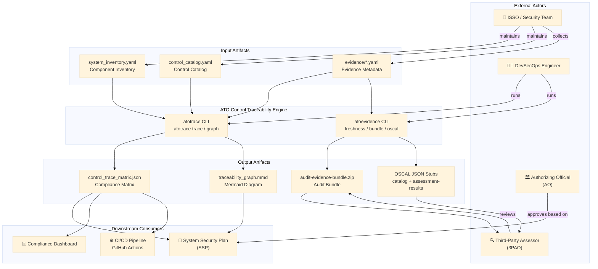

# System Context Diagram

<!-- SPDX-License-Identifier: Apache-2.0 -->

This diagram shows the ATO Control Traceability Engine in the context of the
broader ATO and continuous monitoring ecosystem.

---

## Actors

| Actor | Role |
|---|---|
| **ISSO** | Maintains inventory, catalog, and evidence files; triggers pipeline |
| **DevSecOps Engineer** | Integrates engine into CI/CD; automates evidence collection |
| **Third-Party Assessor** | Consumes audit bundles and OSCAL exports for assessment activities |
| **Authorizing Official** | Uses SSP and compliance matrix to make risk acceptance decisions |

## System Boundary

The ATO Control Traceability Engine operates entirely within the source
control repository.  It has **no network dependencies** at runtime — all inputs
are local files and all outputs are local files.

The only external interaction is via the CI/CD pipeline which may publish
outputs to an artifact store or documentation site.
