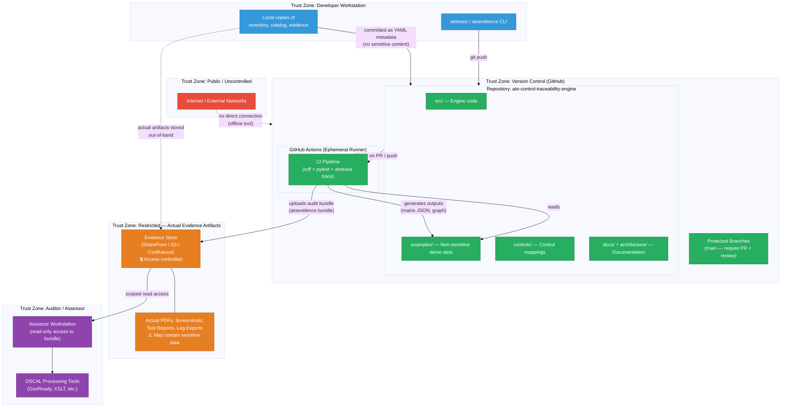

# Trust Boundaries

<!-- SPDX-License-Identifier: Apache-2.0 -->

This diagram identifies trust zones and data sensitivity classifications
within the ATO Control Traceability Engine deployment.

---

## Trust Boundary Summary

| Zone | Contents | Sensitivity |
|---|---|---|
| **Public** | External networks | N/A — no access |
| **Developer Workstation** | CLI tools, local file copies | LOW — no production secrets |
| **Version Control (GitHub)** | Source code, YAML metadata, demo data | LOW — public repo; no sensitive evidence |
| **GitHub Actions** | Ephemeral CI runners | LOW — no secrets; read-only evidence |
| **Restricted Evidence Store** | Actual PDFs, test reports, log exports | **HIGH — may contain sensitive system info** |
| **Auditor / Assessor** | Read-only access to bundles and OSCAL | MEDIUM — scoped access only |

---

## Key Security Properties

1. **No secrets in source control** — all credentials are managed via GitHub
   Secrets / AWS IAM roles; no hard-coded secrets in any file.

2. **Evidence metadata ≠ evidence content** — YAML metadata files committed to
   the repository contain only paths and descriptions.  Actual evidence files
   (potentially sensitive) are stored out-of-band in an access-controlled store.

3. **`yaml.safe_load()` enforced everywhere** — all YAML parsing uses
   `safe_load()` to prevent arbitrary code execution via malicious YAML.

4. **Read-only CI runner** — the CI pipeline reads input files and writes
   outputs within the repository; it does not have write access to external
   systems.

5. **Branch protection** — the `main` branch requires a pull request and
   reviewer approval before any changes merge, preventing unauthorised
   modification of catalog or inventory files.
